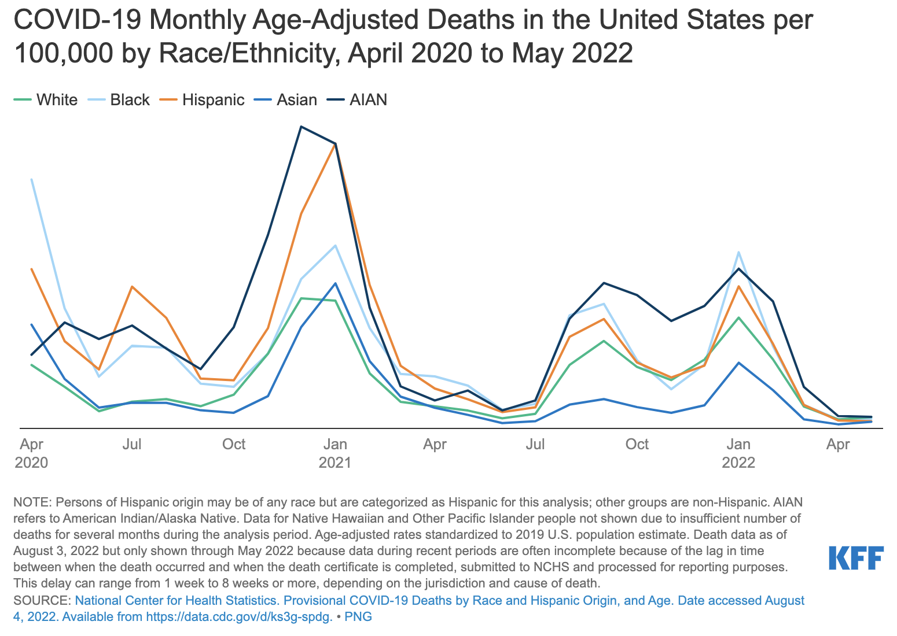

<script>
   $(document).ready(function() {
     $head = $('#header');
     $head.prepend('')
   });
</script>

```{r setup, include=FALSE}
knitr::opts_chunk$set(echo = TRUE)
library(janitor)
library(tidyverse)
library(RColorBrewer)
```


# Introduction

**Health equity** is a pressing issue in the U.S. People of different racial/ethnic backgrounds experience higher rates of poor health, inadequate care, and disease than those who are white. People seeking health care are refused adequate service based soley on their racial/ethnic background.
This study will be looking at the differences in COVID-19 based on race/ethnicity.
There are many factors that can lead to these disparities, race/ethnicity alone will not be used as an explanation if any disparities are found.

&nbsp;

# Data Obtaining

The dataset for the project, "Provisional COVID-19 Deaths: Distribution of Deaths by Race and Hispanic Origin", was downloaded from the CDC website, saved, and imported as a CSV file. The same was done for data on COVID-19 Case data Provisional COVID-19 Deaths: Distribution of Cases by Race and Hispanic Origin."

&nbsp;

# Data Cleaning and Wrangling

```{r,warning=FALSE,message=FALSE}
death.data<-read.csv("/Users/celestepicone/Library/CloudStorage/OneDrive-UniversityofPittsburgh/HDS/Project/COVID_death_distribution.csv")%>%
  select(-c(Data.as.of,Start.Date,End.Date))

case.data<-read.csv("/Users/celestepicone/Library/CloudStorage/OneDrive-UniversityofPittsburgh/HDS/Project/COVID_case_distribution.csv",header = FALSE)%>%
filter(!row_number() %in% c(1, 2))%>%
  row_to_names(1)%>%mutate(`Percent of cases`= as.numeric(`Percent of cases`),`Count of cases`= as.numeric(`Count of cases`),`Percent of US population`= as.numeric(`Percent of US population`))

totals.data<-death.data%>% filter(Group == "By Total")%>%
  select(-Month)

totals.US<- totals.data%>%filter(State =="United States") %>%
  select(-c(Year, Group, State, Footnote))%>%t()%>%as.data.frame()%>%
  row_to_names(row_number = 1)%>%mutate(`Count of COVID-19 deaths`= as.numeric(`Count of COVID-19 deaths`),`Distribution of COVID-19 deaths (%)`= as.numeric(`Distribution of COVID-19 deaths (%)`),`Unweighted distribution of population (%)`= as.numeric(`Unweighted distribution of population (%)`),`Weighted distribution of population (%)`= as.numeric(`Weighted distribution of population (%)`))%>%mutate(`Total Population`=((`Unweighted distribution of population (%)`/100)*331893745))%>%mutate(`COVID-19 Death rate (%)` = (`Count of COVID-19 deaths`/`Total Population`)*100,RaceEthnicity=c("White","Black","American Indian/Native Alaskan",  "Asian","Native Hawaiian/Other Pacific Islander","More than One Race","Hispanic/Latino"))%>%mutate(`COVID-19 Deaths per 100,000` = (`Count of COVID-19 deaths`/`Total Population`)*100000)

totals.US<- cbind(Race.Ethnicity = rownames(totals.US), totals.US)
rownames(totals.US) <- 1:nrow(totals.US)

totals.state<-totals.data%>%filter(State !="United States",Indicator=="Distribution of COVID-19 deaths (%)") %>%
  select(-c(Year,Group,Footnote,Indicator))

library(lubridate)

monthly.data<-death.data%>%filter(Group=="By Month",State=="United States")%>%select(-Group,-State,-Footnote)%>%pivot_longer(cols=!c(Year,Month,Indicator),names_to = "Race/Ethnicity",values_to = "Value")%>%pivot_wider(names_from = Indicator, values_from = Value)%>%mutate(`Count of COVID-19 deaths`= as.numeric(`Count of COVID-19 deaths`),`Distribution of COVID-19 deaths (%)`= as.numeric(`Distribution of COVID-19 deaths (%)`),`Unweighted distribution of population (%)`= as.numeric(`Unweighted distribution of population (%)`),`Weighted distribution of population (%)`= as.numeric(`Weighted distribution of population (%)`))%>%mutate(`Total Population`=((`Unweighted distribution of population (%)`/100)*331893745))%>%mutate(`COVID-19 Deaths per 100,000` = (`Count of COVID-19 deaths`/`Total Population`)*100000,Date=(paste(Year, Month, sep="-")))%>%mutate(Date=ym(Date))


monthly.data$`Race/Ethnicity`=gsub("Non.Hispanic.White","White",monthly.data$`Race/Ethnicity`)

monthly.data$`Race/Ethnicity`=gsub("Non.Hispanic.Black.or.African.American","Black",monthly.data$`Race/Ethnicity`)

monthly.data$`Race/Ethnicity`=gsub("Non.Hispanic.American.Indian.or.Alaska.Native","AIAN",monthly.data$`Race/Ethnicity`)

monthly.data$`Race/Ethnicity`=gsub("Non.Hispanic.Asian","Asian",monthly.data$`Race/Ethnicity`)

monthly.data$`Race/Ethnicity`=gsub("Non.Hispanic.Native.Hawaiian.or.Other.Pacific.Islander","NHPI",monthly.data$`Race/Ethnicity`)

monthly.data$`Race/Ethnicity`=gsub("Non.Hispanic.more.than.one.race","More than One Race",monthly.data$`Race/Ethnicity`)

monthly.data$`Race/Ethnicity`=gsub("Hispanic.or.Latino","Hispanic/Latino",monthly.data$`Race/Ethnicity`)
```


## COVID Case Distribution

The case data was very manageable and only needed minimal manipulation.
We changed the rows to column names and made the data numeric.

```{r}
case.data
```

&nbsp;


## COVID Death Distribution

The raw death data was imported as a csv file.

```{r}
death.data
```
&nbsp;

## Monthly Data

To created the monthly death data, we filtered death data for month and total data. We then manipulated the data and tidied it. Finally created a variable for deaths per 100,000. We can use this data to create a time series plot and see the months when COVID deaths were at their peak.
```{r}
monthly.data
```

&nbsp;

## Totals Deaths for the Entire U.S.

To create the total death data for the U.S. we removed data that was not considered relevant to the study and filtered for U.S. and totals. Next, we created a death rate variable. The US population from July 2021 (331,893,745) was used to find the total number of people in each group and further the COVID-19 Death rate for each of the groups. We can use this death rate to see if there is a significant difference between them across the groups.

```{r}
totals.US
```
&nbsp;

## Total Death Data per State

To create the dataset for total death data per state, we filtered for states and totals. We then manipulated the data to be in a usable format, with reasonable column names.

```{r}
totals.state%>%pivot_longer(cols=2:8,names_to = "Race/Ethnicity", values_to = "Percent of Statewide COVID Deaths")
```


&nbsp;

# Analyses


## Cases
```{r,message=FALSE,warning=FALSE}

case.data%>%ggplot(aes(x = reorder(`Race/Ethnicity`, -`Percent of cases`), y=`Percent of cases`,fill=`Race/Ethnicity`)) +geom_bar(stat="identity",color="black")+ theme_bw()+
  theme(legend.position = "none",axis.text.x = element_text(angle = 45, vjust = 1, hjust=1),plot.title = element_text(hjust = 0.5,face="bold"),axis.title.y = element_text(margin = margin(r = 20)))+ xlab("Race/Ethnicity")+ scale_fill_brewer(palette="Set1")+ggtitle("COVID-19 Cases by Race/Ethnicity")+scale_x_discrete(labels=c("White\nNon-Hispanic", "Hispanic\n/Latino", "Black\nNon-Hispanic","Asian\nNon-Hispanic", "Multiple/Other\nNon-Hispanic","American Indian\n/Alaska Native\nNon-Hispanic","Native Hawaiian\n/Pacific Islander\nNon-Hispanic"))+ylim(0,60)+geom_text(aes(label = `Percent of cases`), vjust = -.5, colour = "black",size=3)+
  scale_fill_manual(values=c("black", "#0082cb","light blue","orange","brown","#f36196","#228B22"))
```

The above bar chart doesn't tell us much due to the differing proportions of races in the United States. It makes sense that the most deaths are attributed to the race which composes most of the U.S. population. More detailed and raw data would be needed to make assumptions or inference on the case data.

&nbsp;

## Statistical Analysis:

We can use a two sample z-test to see if the true death rates are homogeneous across the groups.
We assume simple random sampling and the expected count in each group is at least 5.

- $H_0$: The true proportions of those who died from COVID-19 are the same across race/ethnicity.
- $H_1$: The true proportions of those who died from COVID-19 are different across race/ethnicity.

The p-values from proportion tests are listed below:
```{r,warning=FALSE,message=FALSE,error=FALSE,include=FALSE}
library(kableExtra)


#white vs black/african american
white_black<-prop.test(c(699108,150041),c(198140565.8,41818611.9),correct=FALSE)$p.value

#white vs american indian/alaskan native
white_americanindian<-prop.test(c(699108,11608),c(198140565.8,2323256.2),correct=FALSE)$p.value

#white vs asian
white_asian<-prop.test(c(699108,33391),c(198140565.8,19581731.0),correct=FALSE)$p.value

#white vs native hawaiian or pacific islander
white_native<-prop.test(c(699108,2228),c(198140565.8,663787.5),correct=FALSE)$p.value

#white vs more than one race
white_more<-prop.test(c(699108,4109),c(198140565.8,7633556.1),correct=FALSE)$p.value

#white vs hispanic/latino
white_hispanic<-prop.test(c(699108,166350),c(198140565.8,61732236.6),correct=FALSE)$p.value


```


```{r,include=FALSE}
#white vs black/african american
a<-prop.test(c(699108,150041),c(198140565.8,41818611.9),correct=FALSE)$p.value

#black vs american indian/alaskan native
b<-prop.test(c(150041,11608),c(41818611.9,2323256.2),correct=FALSE)$p.value

#black vs asian
c<-prop.test(c(150041,33391),c(41818611.9,19581731.0
),correct=FALSE)$p.value

#black vs native hawaiian or pacific islander
d<-prop.test(c(150041,2228),c(41818611.9,663787.5),correct=FALSE)$p.value

#black vs more than one race
e.df<-prop.test(c(150041,4109),c(41818611.9,7633556.1
),correct=FALSE)$p.value

#black vs hispanic/latino
f<-prop.test(c(150041,166350
),c(41818611.9,61732236.6
),correct=FALSE)$p.value


```

```{r,include=FALSE}
#american indian/alaskan native vs black/african american
g<-prop.test(c(11608,150041),c(2323256.2,41818611.9),correct=FALSE)$p.value

#white vs american indian/alaskan native
h<-prop.test(c(699108,11608),c(198140565.8,2323256.2),correct=FALSE)$p.value

#american indian/alaskan native vs asian
i<-prop.test(c(11608,33391),c(2323256.2,19581731.0
),correct=FALSE)$p.value

#american indian/alaskan native vs native hawaiian or pacific islander
j<-prop.test(c(11608,2228),c(2323256.2,663787.5),correct=FALSE)$p.value

#american indian/alaskan native vs more than one race
k<-prop.test(c(11608,4109),c(2323256.2,7633556.1),correct=FALSE)$p.value

#american indian/alaskan native vs hispanic/latino
l<-prop.test(c(11608,166350
),c(2323256.2,61732236.6
),correct=FALSE)$p.value
```

```{r,include=FALSE}
#asian vs black/african american
m<-prop.test(c(33391,150041),c(19581731.0,41818611.9),correct=FALSE)$p.value

#white vs asian
n<-prop.test(c(699108,33391),c(198140565.8,19581731.0
),correct=FALSE)$p.value

#asian vs native hawaiian or pacific islander
o<-prop.test(c(33391,2228),c(19581731.0,663787.5),correct=FALSE)$p.value

#asian vs more than one race
p<-prop.test(c(33391,4109),c(19581731.0,7633556.1
),correct=FALSE)$p.value

#asian vs hispanic/latino
q<-prop.test(c(33391,166350
),c(19581731.0,61732236.6
),correct=FALSE)$p.value

```

```{r,include=FALSE}
#native hawaiian or pacific islander vs black/african american
r<-prop.test(c(2228,150041),c(663787.5,41818611.9),correct=FALSE)$p.value

#native hawaiian or pacific islander vs american indian/alaskan native
s<-prop.test(c(2228,11608),c(663787.5,2323256.2),correct=FALSE)$p.value

#native hawaiian or pacific islander vs asian
t<-prop.test(c(2228,33391),c(663787.5,19581731.0),correct=FALSE)$p.value

#white vs native hawaiian or pacific islander
u<-prop.test(c(699108,2228),c(198140565.8,663787.5),correct=FALSE)$p.value

#native hawaiian or pacific islander vs more than one race
v<-prop.test(c(2228,4109),c(663787.5,7633556.1),correct=FALSE)$p.value

#native hawaiian or pacific islander vs hispanic/latino
w<-prop.test(c(2228,166350),c(663787.5,61732236.6),correct=FALSE)$p.value
```

```{r,include=FALSE}
#more than one race vs black/african american
x<-prop.test(c(4109,150041),c(7633556.1,41818611.9),correct=FALSE)$p.value

#more than one race vs american indian/alaskan native
y<-prop.test(c(4109,11608),c(7633556.1,2323256.2),correct=FALSE)$p.value

#more than one race vs asian
z<-prop.test(c(4109,33391),c(7633556.1,19581731.0
),correct=FALSE)$p.value

#more than one race vs native hawaiian or pacific islander
a1<-prop.test(c(4109,2228),c(7633556.1,663787.5),correct=FALSE)$p.value

#white vs more than one race
b1<-prop.test(c(699108,4109),c(198140565.8,7633556.1
),correct=FALSE)$p.value

#more than one race vs hispanic/latino
c1<-prop.test(c(4109,166350
),c(7633556.1,61732236.6
),correct=FALSE)$p.value
```


```{r,include=FALSE}
#hispanic/latino vs black/african american
d1<-prop.test(c(166350,150041),c(61732236.6,41818611.9),correct=FALSE)$p.value

#hispanic/latino vs american indian/alaskan native
e1<-prop.test(c(166350,11608),c(61732236.6,2323256.2),correct=FALSE)$p.value

#hispanic/latino vs asian
f1<-prop.test(c(166350,33391),c(61732236.6,19581731.0),correct=FALSE)$p.value

#hispanic/latino vs native hawaiian or pacific islander
g1<-prop.test(c(166350,2228),c(61732236.6,663787.5),correct=FALSE)$p.value

#hispanic/latino vs more than one race
h1<-prop.test(c(166350,4109),c(61732236.6,7633556.1),correct=FALSE)$p.value

#white vs hispanic/latino
i1<-prop.test(c(699108,166350),c(198140565.8,61732236.6),correct=FALSE)$p.value
          
       
          
```

```{r}
prop<-data.frame(t(matrix(c("---",round(a,5),round(h,5),round(n,5),round(u,5),round(b1,5),round(white_hispanic,5),"---","---",round(b,5),round(c,5),round(d,5),round(e.df,5),round(f,5),"---","---","---",round(i,5),round(j,5),round(k,5),round(l,5),"---","---","---","---",round(o,5),round(p,5),round(q,5),"---","---","---","---","---",round(v,5),round(w,5),"---","---","---","---","---","---",round(c1,5),"---","---","---","---","---","","---"),nrow=7,ncol=7)))%>%rename("White"=X1,"Black"=X2,"American Indian/Native Alaskan"=X3,"Asian"=X4,"Native Hawaiian/Pacific Islander"=X5,"Other"=X6,"Hispanic/Latino"=X7)

rownames(prop) <- c("White","Black","American Indian/Native Alaskan","Asian","Native Hawaiian/Pacific Islander","Other","Hispanic/Latino")
table<-kable(prop, format = "html", 
      row.names = TRUE,align = "c") %>%
    kable_styling(bootstrap_options = "striped",
                  full_width = TRUE)%>%column_spec(1, bold = T, border_right = T)%>%column_spec (1:8,border_left = T, border_right = T,extra_css = "vertical-align:middle;") %>% row_spec(0:7, extra_css = "border-bottom: 1px solid;" )%>% add_header_above(c("","P-Value from Two Sample Z-Test"=7))
table

```

Due to the small p-values in each of the tests, we can reject the null, that the proportions of deaths due to COVID-19 are the same and conclude that there are significant differences in COVID-19 death rates between all races/ethnicities.

&nbsp;


```{r,message=FALSE,warning=FALSE}
totals.US%>%mutate(`COVID-19 Deaths per 100,000`=round(`COVID-19 Deaths per 100,000`,3))%>%ggplot(aes(x = reorder(RaceEthnicity, -`COVID-19 Deaths per 100,000`), y=`COVID-19 Deaths per 100,000`,fill=RaceEthnicity)) +
    geom_bar(stat="identity",color="black")+ theme_bw()+
  theme(legend.position = "none",axis.text.x = element_text(angle = 45, vjust = 1, hjust=1),plot.title = element_text(hjust = 0.5,face="bold"),axis.title.y = element_text(margin = margin(r = 20)))+ xlab("Race/Ethnicity")+ scale_fill_brewer(palette="Set2")+scale_x_discrete(labels=c("American Indian\n/Alaska Native\nNon-Hispanic","Black\nNon-Hispanic","White\nNon-Hispanic","Native Hawaiian\n/Pacific Islander\nNon-Hispanic", "Hispanic\n/Latino", "Asian\nNon-Hispanic", "Multiple/Other\nNon-Hispanic"))+ggtitle("COVID-19 Death Rate by Race/Ethnicity")+ylim(0,600)+geom_text(aes(label = `COVID-19 Deaths per 100,000`), vjust = -.5, colour = "black",size=3)+
  scale_fill_manual(values=c("black", "#0082cb","light blue","orange","brown","#f36196","#228B22"))
```

We can't form any opinions from the above bar chart since there is a difference in the distribution of age per each race/ethnicity. The white population, in the U.S. is an older population than the black population in the U.S., meaning that we need to adjust for age in future studies.

&nbsp;

## Deaths by Race/Ethnicity Over Time

```{r}

monthly.data%>%ggplot(aes(x=Date,y=`COVID-19 Deaths per 100,000`,group=`Race/Ethnicity`))+
  geom_line(aes(color=`Race/Ethnicity`))+theme_bw()+
    ggtitle("COVID-19 Deaths per 100,000 by Race/Ethnicity")+ylab(NULL)+xlab("Date")+theme(legend.position = c(0.365, 0.9),legend.box = "horizontal",legend.title= element_blank(),legend.direction="horizontal",legend.box.background = element_rect(colour = "black"),plot.title = element_text(hjust = 0.5,face="bold"),panel.grid.minor = element_blank())+ylim(0,68)+scale_x_date(date_labels = "%b\n%Y",date_breaks = "3 month")+
  coord_cartesian(expand = FALSE)+ scale_color_manual(values=c("black", "#0082cb","light blue","orange","brown","#f36196","#228B22"))

```

This timeseries plot shows the fluctuation of the COVID-19 deaths in the U.S. by race/ethnicity. The plot generally follows our data from the bar chart for total deaths per 100,000 by race/ethnicity. We can see that the AIAN group stays above the other groups for almost all months.

&nbsp;

## Map of US

&nbsp;

**To use the map: Hover over the state for which you would like to see the distribution of COVID-19 deaths.**


**The total counts of COVID deaths are indicated by color.**

```{r,warning=FALSE,message=FALSE,error=FALSE}
library(tidyverse)
library(leaflet)
library(stringr)
library(sf)
library(here)
library(maps)
library(widgetframe)
library(usmap)
library(ggplot2)
library(rgdal)
library(htmltools)

state.counts<-read.csv("/Users/celestepicone/Library/CloudStorage/OneDrive-UniversityofPittsburgh/HDS/Project/StateCounts.csv")
state.counts<-state.counts[-c(1,2),]
state.counts<-state.counts%>%rename(NAME=Number.of.COVID.19.deaths.in.the.United.States.as.of.December.9..2022..by.state)%>%rename(COVID.Count=X)
state_spdf <- read_sf("/Users/celestepicone/Downloads/cb_2021_us_state_20m 2/cb_2021_us_state_20m.shp")%>%left_join(state.counts,by="NAME")

p<-totals.state%>%rename(NAME=State)
popup.data<-left_join(state_spdf,p,by="NAME")%>%filter(NAME!="Puerto Rico")
popup.data<-popup.data%>%mutate(Non.Hispanic.White=as.character(Non.Hispanic.White),Non.Hispanic.Black.or.African.American=as.character(Non.Hispanic.Black.or.African.American),Non.Hispanic.American.Indian.or.Alaska.Native=as.character(Non.Hispanic.American.Indian.or.Alaska.Native),Non.Hispanic.Asian=as.character(Non.Hispanic.Asian),Non.Hispanic.Native.Hawaiian.or.Other.Pacific.Islander=as.character(Non.Hispanic.Native.Hawaiian.or.Other.Pacific.Islander),Non.Hispanic.more.than.one.race=as.character(Non.Hispanic.more.than.one.race),Hispanic.or.Latino=as.character(Hispanic.or.Latino))%>%  mutate_if(is.character, ~replace(., is.na(.), "N/A"))

pal<-brewer.pal(51,"Set1")

numpal <- colorNumeric(rev(viridis::viridis(256)), state_spdf$COVID.Count)

popup.data %>%
  mutate(popup = str_c("<strong>", NAME," - % of COVID Deaths" ,"</strong>",
                       "<br/>",
                       "White: ", Non.Hispanic.White,
                       "<br/>",
                       "Black: ", Non.Hispanic.Black.or.African.American,
                       "<br/>",
                       "American Indian/Alaska Native: ", Non.Hispanic.American.Indian.or.Alaska.Native,
                       "<br/>",
                       "Asian: ", Non.Hispanic.Asian,
                       "<br/>",
                       "Native Hawaiian/Pacific Islander: ", Non.Hispanic.Native.Hawaiian.or.Other.Pacific.Islander,
                       "<br/>",
                       "More than One Race: ", Non.Hispanic.more.than.one.race,
                       "<br/>",
                       "Hispanic/Latino: ", Hispanic.or.Latino) %>% lapply(htmltools::HTML)) %>%
  leaflet() %>%
  addTiles() %>%
  addPolygons(label = ~popup,
              fillColor = ~numpal(COVID.Count),
              color = "#444444",
              weight = 1,
              smoothFactor = 0.5,
              opacity = 1.0,
              fillOpacity = 0.5,
              highlightOptions = highlightOptions(color = "white",
                                                  weight = 2,
                                                  bringToFront = TRUE),
              labelOptions = labelOptions(
                style = list("font-weight" = "normal", padding = "3px 8px"),
                textsize = "12px",
                direction = "auto"))%>%fitBounds(-210.116142 , 71.543289, -63.186465, 17.699315)%>%
  addLegend("bottomleft", pal = numpal, values = ~COVID.Count,
            title = htmltools::HTML("State COVID Total Deaths"),
            opacity = 1)


```

This map was mostly created to further my knowledge of the visualizations that R is able to do. The states are colored based on the total COVID-19 deaths attributed to the state. The popups for each state show the percent of total state COVID-19 deaths that are attributable to each race/ethnicity group.
&nbsp;

# Discussion


## True Age-Adjusted Death Data




We can see that the true age-adjusted death data somewhat follows what we found in both of the barplots and the linegraph. It is interesting that they follow the same general trend even when my data was not (to my knowledge) age-adjusted.

&nbsp;


## Limitations

I don't trust the results of this study based on the available data. The only data available was aggregate and seemed to have already made adjustments. Not all cases of COVID-19 are reported, so this may impact the validity of the data. People may decide to leave off race/ethnicity on their survey or feel like they do not fit into any of the race/ethnicity categories. For future I would hope to find better data or make better data by combining more datasets.Finally, I would want to adjust for age since there is a high amount of older white people in the U.S. compared to other race/ethnicities.

&nbsp;


# Conclusion

Based on all of our p-values being less than 0.05, we can reject our null hypothesis and conclude that there is a difference in the proportions of those who die from COVID across race/ethnicity. The bar chart and the timeseries plots further affirm these findings.
In the future, we would hope to adjust for age. Public health officials should look further into the reasonings for these disparities. Race/ethnicity should not be a barrier to care.


